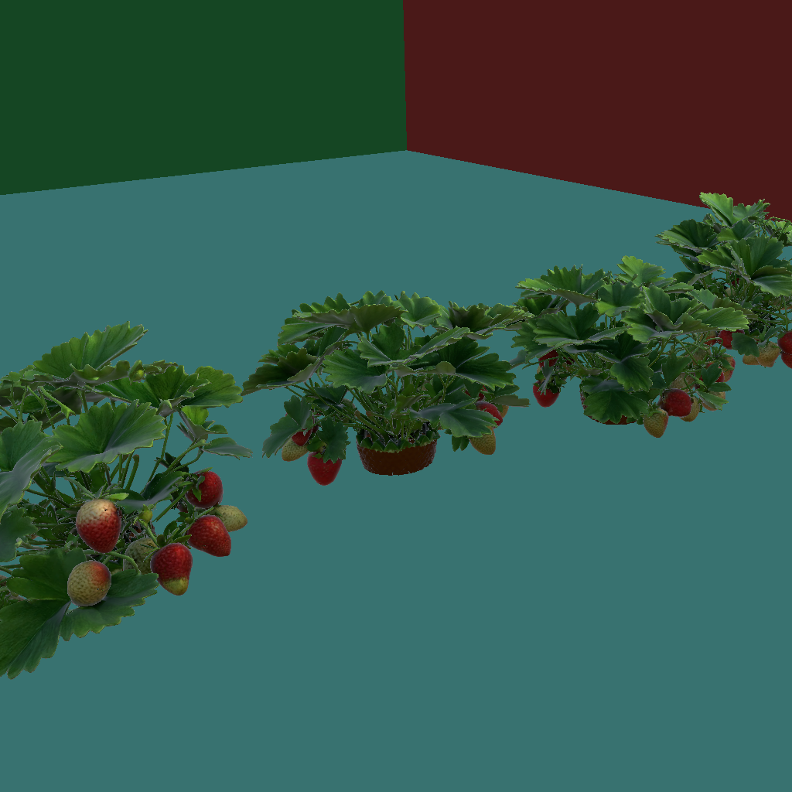
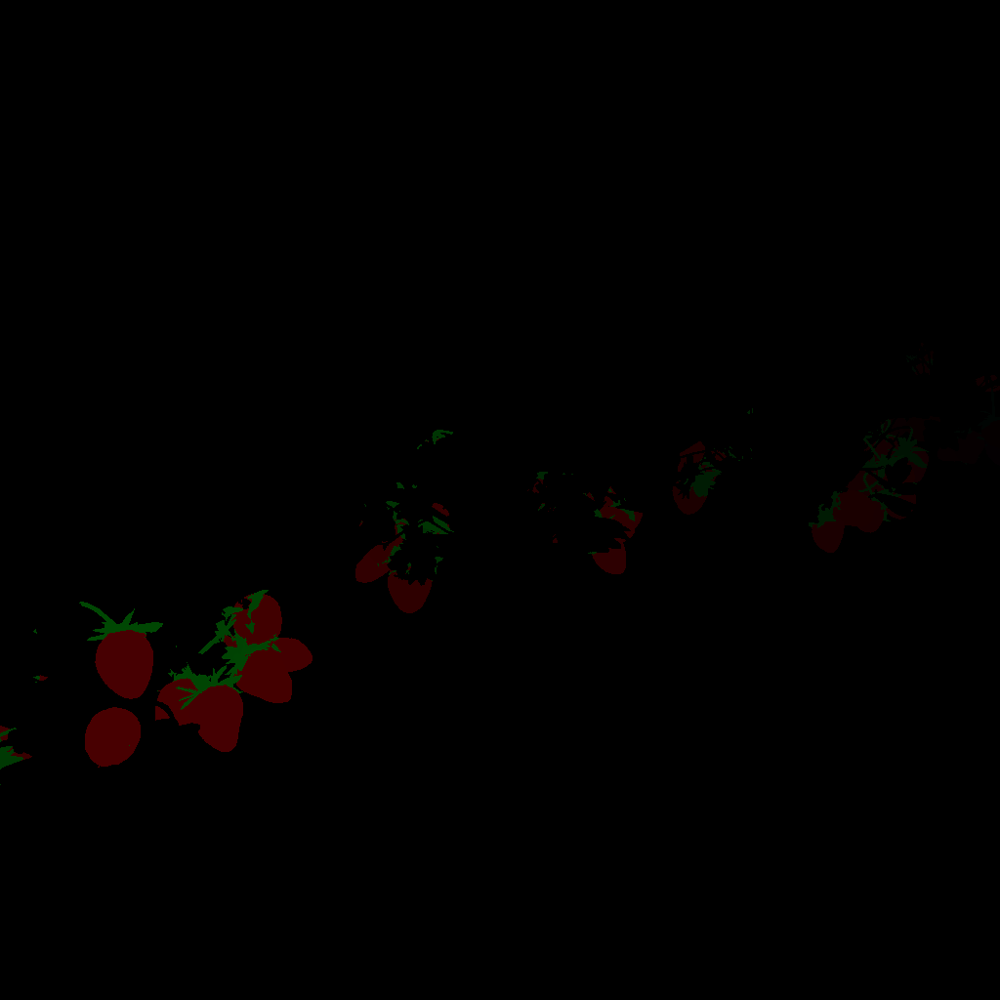
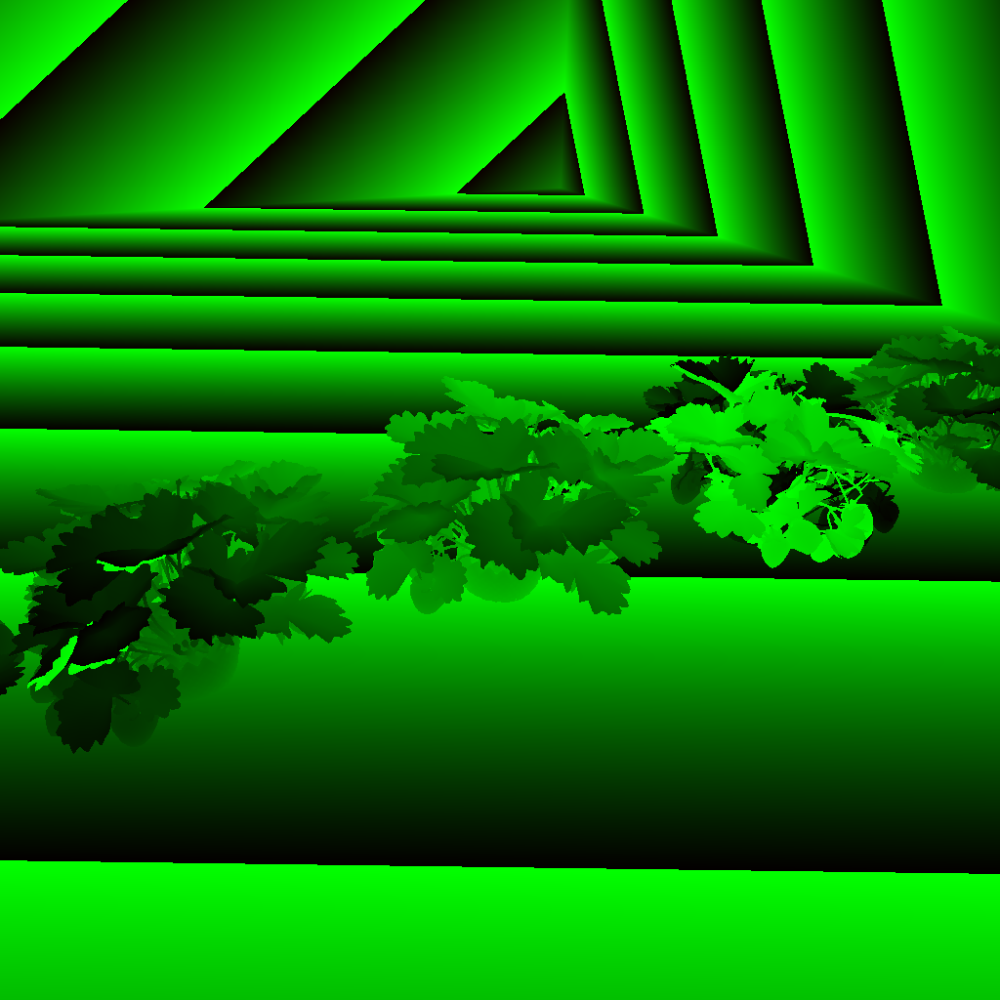
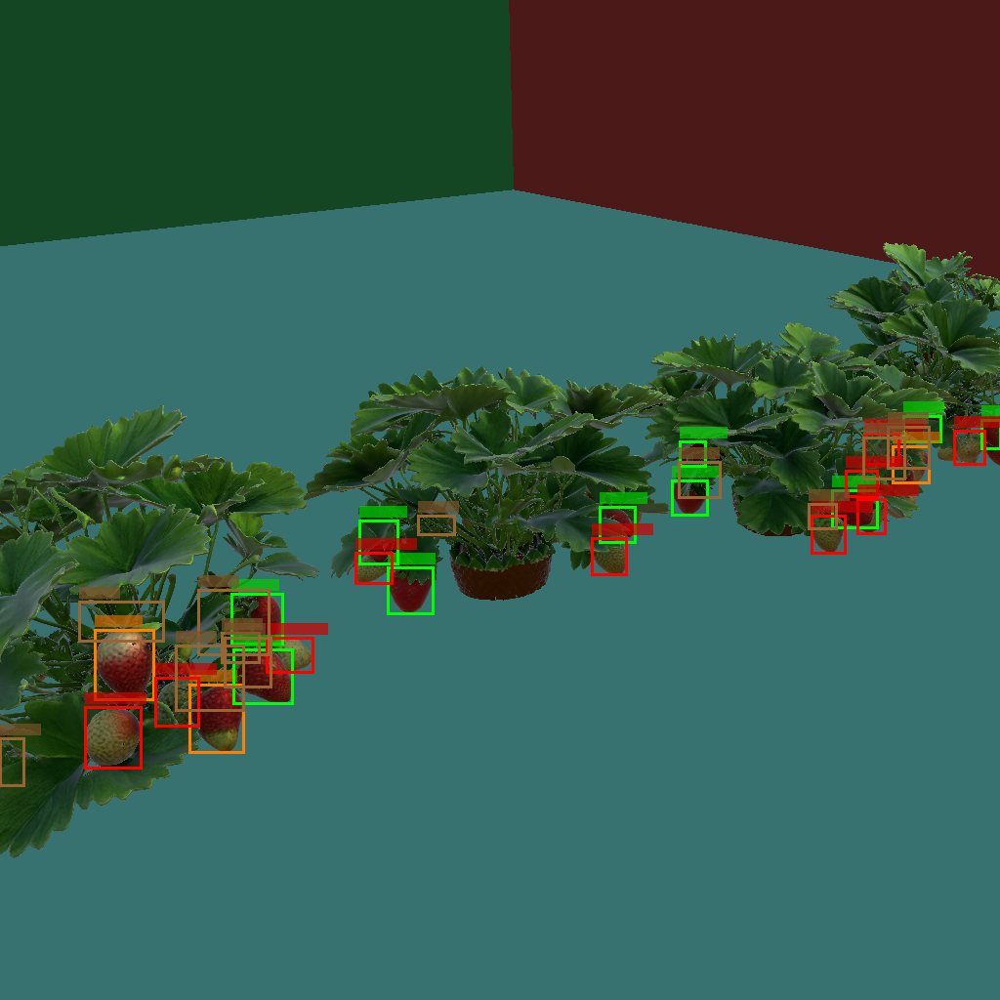
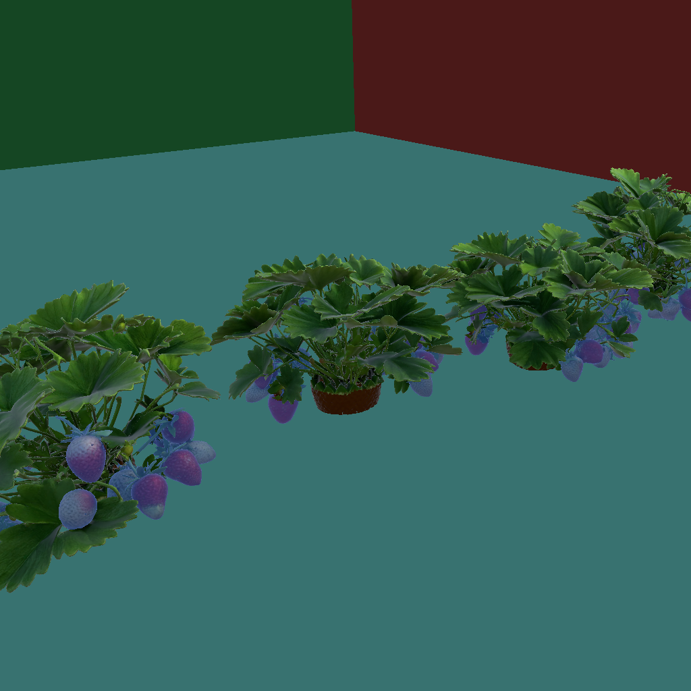

# Synthetic Strawberry Dataset Generator

Automated Unity-based system for generating synthetic training datasets for strawberry detection, segmentation, classification, matching, and depth estimation tasks.

**Repository**: [https://github.com/SergKurchev/strawberry_synthetic_dataset](https://github.com/SergKurchev/strawberry_synthetic_dataset)

## Overview

This tool generates photorealistic synthetic scenes of strawberry bushes in greenhouse environments. It produces comprehensive annotations for:
1. **Instance Segmentation**: YOLO format for strawberries and peduncles.
2. **Classification**: Ripe vs Unripe labeling.
3. **Matching**: Tracking the connection between a strawberry and its peduncle (stem).
4. **Depth Estimation**: High-precision depth maps and camera intrinsics.

4. **Depth Estimation**: High-precision depth maps and camera intrinsics.

### 📥 Downloading the Dataset

The dataset is ~4.4GB and has been split into multiple parts (`strawberry_dataset.zip.001`, `strawberry_dataset.zip.002`...) due to file size limits.

1.  Go to the **[Releases](https://github.com/SergKurchev/strawberry_synthetic_dataset/releases)** section.
2.  Download all parts.
3.  Combine/Extract them:
    *   **7-Zip (Windows)**: Right-click `.001` file -> "7-Zip" -> "Extract Here".
    *   **Cat (Linux/Mac)**: `cat strawberry_dataset.zip.* > strawberry_dataset.zip` then unzip.

## Visualizations

Below are examples of the data generated by this tool.

|            RGB Image            |           Instance Mask           |              Depth Map              |
| :-----------------------------: | :-------------------------------: | :---------------------------------: |
|  |  |  |

|          Bounding Boxes           |              Mask Overlay               |
| :-------------------------------: | :-------------------------------------: |
|  |  |

For a comprehensive overview, check the **Kaggle Notebook**: [Scripts/kaggle_dataset_overview.ipynb](Scripts/kaggle_dataset_overview.ipynb)

## Quick Start (Loading the Dataset)

Use the following Python snippet to unzip and load the dataset annotations.

```python
import zipfile
import json
import numpy as np
from pathlib import Path
from PIL import Image

# 1. Unzip the dataset
# Note: Ensure you have combined the split files first if downloaded from Releases.
zip_path = Path("strawberry_dataset.zip")
extract_path = Path("dataset")

if zip_path.exists() and not extract_path.exists():
    print("Extracting dataset...")
    with zipfile.ZipFile(zip_path, 'r') as zip_ref:
        zip_ref.extractall(extract_path)
    print("Extraction complete.")

# 2. Load Annotations
dataset_path = extract_path / "strawberry_dataset" # Adjust based on zip structure
if not dataset_path.exists(): dataset_path = extract_path # Fallback

with open(dataset_path / "annotations.json", "r") as f:
    data = json.load(f)

print(f"Loaded {len(data['images'])} images and {len(data['annotations'])} annotations.")

# 3. Load an Image and Depth Map
img_info = data['images'][0]
img_path = dataset_path / "images" / img_info['file_name']
depth_path = dataset_path / "depth" / img_info['file_name']

# Load RGB
image = Image.open(img_path).convert("RGB")

# Load Depth (16-bit PNG decoding)
depth_img = np.array(Image.open(depth_path))
# Combine high and low bytes: depth_mm = (R << 8) | G
depth_mm = (depth_img[:,:,0].astype(np.uint16) << 8) | depth_img[:,:,1].astype(np.uint16)
depth_m = depth_mm.astype(np.float32) / 1000.0

print(f"Image size: {image.size}, Max depth: {depth_m.max():.2f}m")
```

## Dataset Structure

Annotated data is organized as follows:

```text
strawberry_dataset/
├── images/                    # RGB images (1024x1024 PNG)
├── labels/                    # YOLO segmentation labels (.txt)
├── depth/                     # Depth maps, 16-bit encoded (.png)
├── depth_npy/                 # Depth maps in meters (.npy float32)
├── masks/                     # Instance segmentation masks (.png RGB)
├── annotations.json           # COCO-style annotations
├── depth_metadata.json        # Camera parameters per image
└── dataset_info.json          # Dataset statistics
```

### Data Formats

*   **YOLO (.txt)**: Normalized polygon coordinates `<class_id> <x1> <y1> ...`
    *   Classes: `0`: ripe, `1`: unripe, `2`: half-ripe, `3`: peduncle
*   **COCO (json)**: Standard format with `bbox`, `area`, and `segmentation_color`.
    *   Custom fields: `ripeness` (string), `parent_id` (int, ID of the connected peduncle).
*   **Depth**: Encoded in RG channels of PNG. `depth_mm = (R * 256) + G`.

## Using the Generator in Unity

To generate your own data:

1.  Open the project in **Unity 2021.3+** (URP).
2.  Navigate to the menu: `Tools > Strawberry Dataset Generator`.
3.  In the control panel:
    *   Set **Output Path**.
    *   Set **Total Samples** (e.g., 1000).
    *   Set **Samples Per Scene** (e.g., 50).
4.  Click **Generate Full Dataset**.

The system will automatically randomize bush placement, camera angles, lighting, and greenhouse dimensions to create diverse training data.
